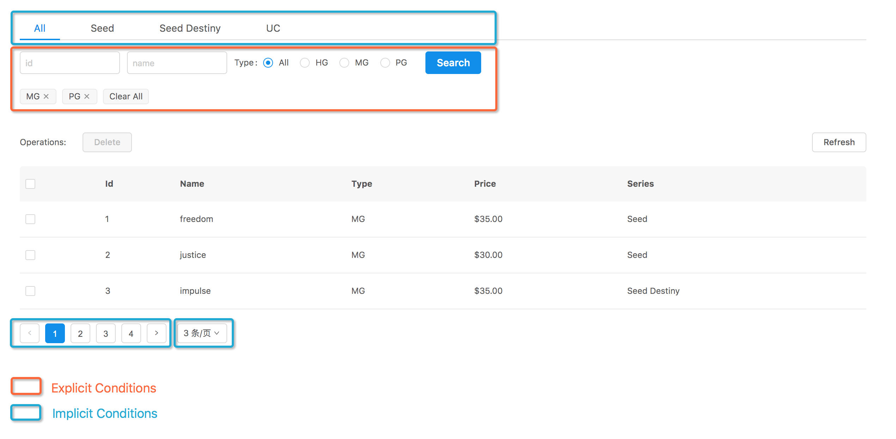

# redux-retrieval

`redux-retrieval`是为检索类应用（例如一个订单管理列表应用或者是一个用户管理列表应用）打造的，
一系列可复用的`actions`, `reducers`, `selectors`和`sagas`，
旨在帮助开发者避免编写可通用的模板代码，从而能更专注于开发独特的业务功能。

`redux-retrieval`的设计受到以下项目的启发：
[react-router-redux](https://github.com/reactjs/react-router-redux),
[redux-saga](https://github.com/redux-saga/redux-saga)
以及 [redux-form](https://github.com/erikras/redux-form).

## 为什么要用 `redux-retrieval`

### 背景

检索类型的应用通常会具有以上截图中的一些或全部功能，比如：**切换页签**，**条件表单检索**，**翻页**，**分页尺寸调整** 等等。
虽然这些功能分散在用户界面的不同位置，但通常这些功能都只依赖一个相同的数据接口，通过不同的参数来实现各自的具体功能。

这些功能之间会有一定的相互作用，并且在不同的需求场景下这些相互作用也会有所不同，
我们可以举例说明某一种场景下的相互作用：

* 切换页签时，不能保留当前 **搜索表单中的条件**，不能保留当前的 **页码**，需要保留当前的 **分页尺寸** 及其他可能的限制条件
* 对搜索表单中的条件进行检索时，不能保留当前的 **页码**，需要保留其他可能的限制条件例如 **页签** **分页尺寸** 等
* 翻页时，需要保留当前所有的条件例如 **搜索表单中的条件**，**页签** 和 **分页尺寸** 等
* 切换分页尺寸时，不能保留当前的 **页码**，需要保留其他可能的限制条件例如 **页签** **搜索表单中的条件** 等

### 问题

如果把这些功能的具体实现都放到业务代码中，会有2个问题：

* **这些功能在同类型的不同业务应用中都具有相同的模式，直接在业务代码中实现这些功能属于重复性劳动**
* **这些功能之间的相互作用较为复杂，有的业务代码会简化实现，导致交互逻辑不正常**

### 结论

`redux-retrieval`为解决以上问题而生，将通用的模式进行了抽象，为业务开发提供了一系列可复用的模块，
**能最小化以上功能的开发量，并保证交互体验**。

## Documentation

* [快速上手](tutorial.md)
* [更多功能](improvement.md)
  - [显式的检索条件](explicit-conditions.md)
  - [隐式的检索条件](implicit-conditions.md)
* API
  - [actions](api/actions.md)
  - [reducers](api/reducers.md)
  - [sagas](api/sagas.md)
  - [selectors](api/selectors.md)

## Examples

可以在[examples目录](./examples)找到以下示例的代码。

* [快速上手教程示例模板代码](../../../examples/beginner-tutorial/)
* [传统数据结构的列表应用](../../../examples/traditional/)
