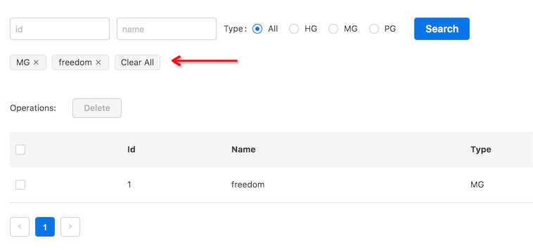
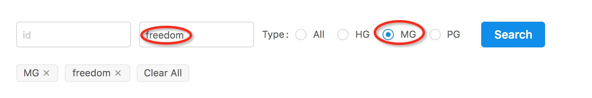

# 显式的检索条件

大多数列表页面都会带有一个检索条件表单，或者叫搜索表单或者过滤表单，我们把这一部分检索条件叫做显式的检索条件。



当检索操作会被执行的比较频繁的时候，有这样的检索条件组件会给用户带来更好的操作体验。

`redux-retrieval`对此也提供了到位的支持。

首先，我们在`reducers/index.js`中增加一个`retrievedConditions`：

```js
import { combineReducers } from 'redux';
import { reducer as form } from 'redux-form'

import {
  retrievedResult,
  retrieving,
  // 引入 retrievedConditions reducer
  retrievedConditions
} from 'redux-retrieval/reducers';

export default combineReducers({
  form,
  appData: retrievedResult,
  // 这里存储的是当前已经成功执行过检索的条件数据
  retrievedConditions,
  retrieving,
});

```


然后，让我们来改造一下`containers/conditions.jsx`：

```js
// ...
import { retrieve } from 'redux-retrieval/actions';
import { conditions } from 'redux-retrieval/selectors';

// ...

export default connect(
  state => ({ data: conditions(state) }),
  dispatch => ({
    onClose: ({ name, value }) => dispatch(
      retrieve({ [name]: value }, { drop: true })
    ),
    onCloseAll: () => {dispatch(retrieve({}))}
  })
)(Conditions);


```

有2个值得注意的地方：

`conditions(state)`：

`conditions(state)`会从`state`中选出显式的检索条件，并格式化成数组类型，便于组件渲染。
详细说明见 [API文档: conditions](./api.md#conditions)。

`retrieve({ [name]: value }, { drop: true })`：

这里第二个参数中的`drop: true`代表的意思是，在当前检索条件中删除第一个参数指定的条件，
并以计算后的条件执行检索。`retrieve`方法更多参数见 [API文档: retrieve](./api.md#retrieve)。

让我们把`Conditions`组件加入到`containers/index.jsx`中去：

```js
// ...
import Conditions from './conditions';

// ...

export default (props) => {
  return (
    <Layout
      title="Beginner Tutorial Of redux-retrieval"
      form={<Form />}
      {/** 把它放在已经定好的位置上 */}
      conditions={<Conditions />}
      list={<List />}
      pagination={<Pagination defaultPageSize={3} defaultCurrent={1} />}
    />
  );
}


```


现在你可以在页面上试试这个功能了。

但是你可能会发现有一点不太和谐：



由于现在用户可以通过点击条件tag来快捷的删除检索条件，然而表单组件并没有保持状态同步，还会保留原有的输入，
这样的话不利于用户发起新的检索动作。所以我们要优化一下，在用户执行检索成功后，将条件表单清空。

要做到这一点，我们需要利用`redux-saga`的特性了，`saga`中可以监听发生的`action`并执行对应的处理（类似于监听一个事件）。

我们需要在`sagas/index.js`中增加一些代码

```js
// ...
// 新增一些必要的引用
import { takeLatest, put } from 'redux-saga/effects';
import { TYPES } from 'redux-retrieval/actions';
import { reset } from 'redux-form';

// ...

export default function* rootSaga() {
  yield [
    retrieveSaga({ service }),
    // 监听检索成功动作并执行清空表单
    takeLatest(TYPES.RETRIEVE_SUCCESS, resetForm),
  ];
}

export function* resetForm() {
  // 表示 dispatch 了这个 reset 动作
  yield put(reset('conditions'));
}

```

由于我们的条件表单使用了`redux-form`，所以我们可以使用它提供的`reset`动作来清空我们的表单，参数`'conditions'`是表单的名字。

现在去页面上试试吧，我们的检索体验应该变的更好一点了。
