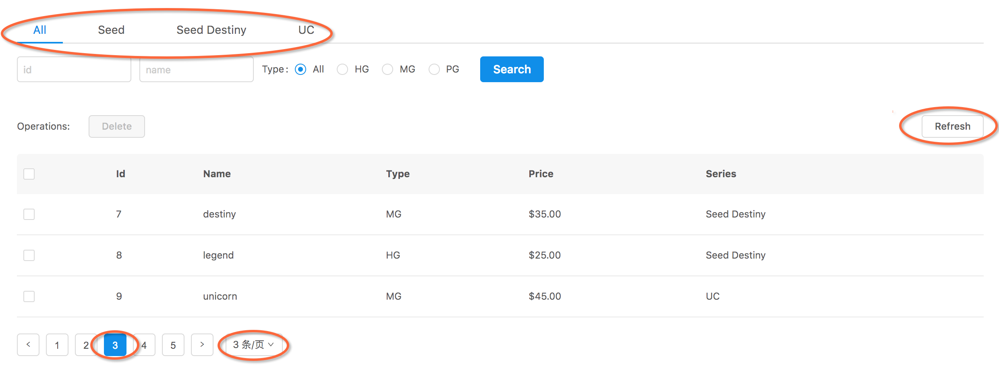

# 隐式的检索条件



红框中的基本都可以算作隐式检索条件，因为他们都不会放在检索表单中，但是却同样需要附加到检索请求中去，
与显式的检索条件共同影响着检索结果。

接下来我们逐一看看如何用`redux-retrieval`处理隐式检索条件的变化。

## Page Size

刚才我们的产品同学小明又屁颠的跑过来给我们提了一个需求：用户需要能够调整每页展示的数据量，并且调整时仍保留当前的检索条件。
我跟他说，好的你等下，30秒给你搞定。

我们先来给`containers/index.jsx`里的分页组件增加一些参数配置：

```js

// ...

export default (props) => {
  return (
    <Layout
      title="Beginner Tutorial Of redux-retrieval"
      form={<Form />}
      conditions={<Conditions />}
      list={<List />}
      pagination={
        <Pagination
          style={styles.pagination}
          {/** 显示分页尺寸选择组件 */}
          showSizeChanger
          {/** 配置分页尺寸 */}
          pageSizeOptions={['3', '5', '10']}
        />
      }
    />
  );
}

```

接下来我们稍微改造一下`containers/pagination.jsx`来处理分页尺寸变化：

```js
// ...
// 引入 retrieve action
import { turnPage, retrieve } from 'redux-retrieval/actions';

// ...

export default connect(
  state => ({
    // ...
  }),
  dispatch => ({
    onChange: page => dispatch(turnPage(page)),
    // 添加对分页尺寸变化的处理
    onShowSizeChange: (current, pageSize) => dispatch(retrieve({ pageSize }, { implicitly: true, page: 1, keepExplicit: true }))
  })
)(Pagination)

```

当分页尺寸发生变化时，我们发起一个`retrieve()`动作，第一个参数`{ pageSize }`设置了当前变化的分页尺寸参数，
第二个参数是`meta`参数，其中：
* `implicitly: true`声明这是一个隐式条件的检索（与显式条件检索的内部逻辑不同）
* `page: 1`则声明将页码条件重置为1（目前这个场景下，不希望保留当前的页码条件）
* `keepExplicit: true`声明需要在检索请求中包含当前的显式检索条件

现在可以去页面上试试了，我们已经完成了小明同学提出的需求。小明说了句，哇你好快，然后就回去了。

由于分页尺寸变更也是一个较为常见的功能，`redux-retrieval`对此提供了一个更加语义化的`switchPageSize`动作，
让我们用这个动作替换之前的`retrieve`动作试试：

```js
// ...
// 用 switchPageSize 替换 retrieve
import { turnPage, switchPageSize } from 'redux-retrieval/actions';

// ...

export default connect(
  state => ({
    // ...
  }),
  dispatch => ({
    onChange: page => dispatch(turnPage(page)),
    // 用 switchPageSize 替换 retrieve
    onShowSizeChange: (current, pageSize) => dispatch(switchPageSize(pageSize, { name: 'pageSize' }))
  })
)(Pagination)

```

`switchPageSize()`第一个参数是`pageSize`的值，第二个是`meta`参数，告知`redux-retrieval`这个检索条件参数的名字是`pageSize`。

现在我们的代码在保持功能一致的情况下，更加的简洁和语义化了。


## Tabs

小明刚刚回去了，没有人来给我们提需求了…

那现在我们只好假装有一个需求，需要我们通过页签列出一个大的分类，通过切换页签，就能过滤出对应分类的数据，
并且我们在表单中填写的检索条件，也限制在当前页签指定的分类下面。

我们已经准备了一个Tabs组件`containers/tabs.jsx`，这些页签基于`series`属性对我们的数据做了一个大的分类。

让我们把它加入到`containers/index.jsx`中：

```js
// ...
// 引入 Tabs 组件
import Tabs from './tabs';

// ...

export default (props) => {
  return (
    <Layout
      title="Beginner Tutorial Of redux-retrieval"
      {/** 把它放在定好的tabs位置上 */}
      tabs={<Tabs defaultActiveKey="" />}
      form={<Form />}
      conditions={<Conditions />}
      list={<List />}
      pagination={
        <Pagination
          style={styles.pagination}
          showSizeChanger
          pageSizeOptions={['3', '5', '10']}
        />
      }
    />
  );
}

```

然后你就能在页面上看到这个页签组了，只不过切换页签还只是在控制台输出一些日志。
接下来我们用`redux-retrieval`来接管切换页签事件，在`containers/tabs.jsx`中做些修改：

```js
// ...
// 引入 retrieve action
import { retrieve } from 'redux-retrieval/actions';

// ...

export default connect(
  undefined,
  dispatch => ({
    // 发起一个特定的检索动作
    onChange: key => dispatch(retrieve({ series: key }, { implicitly: true, page: 1 }))
  })
)(PureTabs);

```

其中`retrieve()`的第一个参数传入了用于检索的参数（页签分类是基于数据的`series`属性的），
第二个参数是`meta`参数，其中：
* `implicitly: true`声明这是一个隐式条件的检索，
* `page: 1`则声明将页码条件重置为1（目前这个场景下，不希望保留当前的页码条件）。

现在可以在页面上进行尝试了，切换页签会根据分类过滤数据，并且表单内的检索条件也被限制在当前的大分类下面了。
你可能注意到了，切换页签时，其他条件都进行了重置，但是分页尺寸（`pageSize`）是没有变化的，
这是隐式条件检索内部逻辑进行的处理（清除显式检索条件、保留当前的隐式检索条件），让交互符合逻辑。

虽然切换页签在不同的场景里会有不同的要求（比如有些场景可能要求切换页签时保留当前其他显式和隐式的检索条件），但较为常见的处理还是与本例中的一样，因此`redux-retrieval`也提供了一个带默认逻辑处理的`switchTab`的action，让我们在`containers/tabs.jsx`换上这个action试试：

```js
// ...
// 引入 switchTab action
import { switchTab } from 'redux-retrieval/actions';

// ...

export default connect(
  undefined,
  dispatch => ({
    // 发起一个特定的检索动作
    onChange: key => dispatch(switchTab(key, { name: 'series' }))
  })
)(PureTabs);

```

`switchTab()`第一个参数是tab的key值，第二个是`meta`参数，告知`redux-retrieval`这个检索条件参数的名字是`series`。

现在我们切换页签，仍然可以得到相同的检索效果，并且还会触发一个语义化的`switchTab()`动作，
可以用来做其他事情（比如打点或者监控之类的）。


## 刷新

列表页可能会承载着一定的管理功能，也就是说用户可能会对某些数据进行操作从而更改了这些数据的状态，
比如用户可能会选择了几条数据进行了批量的状态更新处理，而该处理是请求了另外一个服务端接口，
当这个批量处理成功后，用户期望能够看到当前的列表数据状态也已经对应的更新了。

此时你就需要用到`redux-retrieval`提供的`reRetrieve()`动作，
它会完全使用当前所有的显式和隐式的检索条件来发起一个检索请求，也就相当于在当前的检索条件下“刷新”了一下。

让我们来用一个稍微蹩脚一点的方式体验一下这个刷新动作
（通常这个动作应该被用在`saga`的处理中，而我们现在要把它用于按钮的点击事件…）。

我们已经提供了一个`containers/refresh.jsx`组件，让我们把它加入到`containers/index.jsx`中：

```js
// ...
// 引入 Refresh 组件
import Refresh from './refresh';

// ...

export default (props) => {
  return (
    <Layout
      title="Beginner Tutorial Of redux-retrieval"
      tabs={<Tabs defaultActiveKey="" />}
      form={<Form />}
      {/** 把它放在定好的operations位置上 */}
      operations={<Refresh>Refresh</Refresh>}
      conditions={<Conditions />}
      list={<List />}
      pagination={
        <Pagination
          style={styles.pagination}
          showSizeChanger
          pageSizeOptions={['3', '5', '10']}
        />
      }
    />
  );
}

```

去页面尝试一下，先执行一些动作，比如切换页签，条件搜索、翻页和切换分页尺寸，然后再点击一下刷新按钮。

我们来看看`containers/refresh.jsx`的实现：

```js
import { connect } from 'react-redux';
import { Button } from 'antd';
import { reRetrieve } from 'redux-retrieval/actions';

export default connect(
  undefined,
  (dispatch) => ({
    onClick: () => dispatch(reRetrieve())
  })
)(Button);


```

就是点击后调用`reRetrieve()`。


## 小结

显示和隐式的检索条件发生变化时的影响会有很多情形，详细讨论可以看[为什么要用`redux-retrieval`](README.md#why)。
