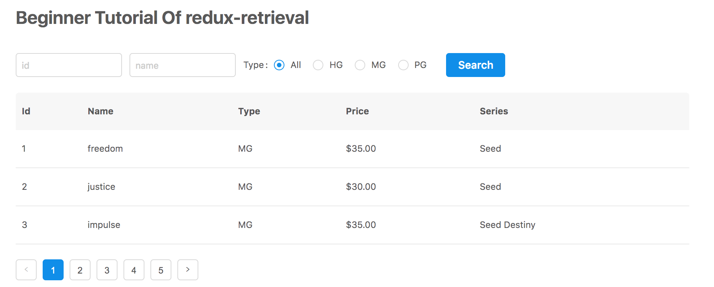

# 快速上手

直接动手完成一个简单的示例应用能让你更容易的理解如何使用`redux-retrieval`。
因此，让我们首先 clone 本仓库并启动`examples`目录中的教程示例应用：

```
$ git clone git@github.com:zincli/redux-retrieval.git

$ cd redux-retrieval/examples
$ npm install
$ npm run tutorial

```

现在访问 [http://localhost:8080/beginner-tutorial/](http://localhost:8080/beginner-tutorial/) 就能看到示例应用的样子了。



这个示例应用是一个典型的带检索条件表单的列表页面，但是目前只是由组件拼出了页面结构，
当你点击搜索按钮或者翻页按钮，还只是通过`console.log()`来输出一些信息。

接下来我们会逐步的使用`redux-retrieval`来完成这个页面的基本检索功能。

## 处理表单搜索

我们的教程代码在 `examples/beginner-tutorial/src` 目录下，以此作为后续的文件路径基准。

我们可以在`containers/form.jsx`文件的最后看到当前对表单提交的处理是打印日志：

```js
// ...

export default connect(
  undefined,
  dispatch => ({
    onSubmit: conditions => console.log('submit: ', conditions)
  })
)(/** ... */)

```

现在，让我们使用`redux-retrieval`提供的`retrieve`动作来处理搜索表单的提交。


```js
// ...
import { retrieve } from 'redux-retrieval/actions';

// ...

export default connect(
  undefined,
  dispatch => ({
    // 用 retrieve 接管表单提交
    onSubmit: conditions => dispatch(retrieve(conditions))
  })
)(...)

```

`retrieve`是一个抽象的`action`，表示我们发出了一个使用`conditions`作为参数来执行检索的动作。


## 处理翻页

类似的，我们要使用`redux-retrieval`提供的`turnPage`动作来处理翻页。

让我们改造一下`containers/pagination.jsx`的代码。

```js
// ...
// 引入 turnPage 动作
import { turnPage } from 'redux-retrieval/actions';
// 引入 page selector
import { page } from 'redux-retrieval/selectors';

// ...

export default connect(
  state => ({
    total: state.appData.total || 0,
    // 给分页组件设置当前页码，如果没给出则处理为1
    current: page(state) || 1,
  }),
  dispatch => ({
    onChange: page => dispatch(turnPage(page))
  })
)(Pagination)

```


## 设置动作处理器

刚刚绑定好的检索和翻页动作，只是纯粹的发出了一个动作，现在还没有什么作用。因此还需要对应的处理器来进行实际的动作响应。
而这其中有些处理是同步的，有些是异步的，`reducers`就来负责处理同步的动作，`sagas`则来负责处理异步动作。
（如果你还不了解`redux-saga`，并没有关系，目前只需要知道它是负责处理一些“不纯粹”的事情的，比如异步接口调用）

### reducers

`redux-retrieval`提供了一个`retrieveResultReducer`，代码非常简单，只是简单的在收到检索成功动作后，
将检索结果返回。

我们用它来替换`reducers/index.js`中的reducer：

```js
import { combineReducers } from 'redux';
import { reducer as form } from 'redux-form'
// 引入 retrievedResult reducer
import { retrievedResult } from 'redux-retrieval/reducers';

export default combineReducers({
  form,
  // 此处为了便于理解，不更改原有的属性名 appData，
  // 如果是新做一个应用，推荐直接使用 retrievedResult 做属性名
  appData: retrievedResult,
});

```

现在我们就能将检索到的结果存储到`state.appData`中了。


### sagas

接下来我们需要用`redux-retrieval`提供的`sagas`对检索动作进行实际的处理和响应。

在`src`目录下创建一个`sagas`目录，并在其中创建一个`index.js`文件：

```js
import { delay } from 'redux-saga';
import retrieveSaga from 'redux-retrieval/sagas';
// 我们有一个内存中的模拟的数据源
import { retrieve } from 'sharing/mock-server';

// 假装我们有一个去远程服务器进行数据检索的服务
const service = {
  retrieve: (conditions, { page }) => {
    return new Promise((resolve) => {
      setTimeout(() => {
        resolve(retrieve({
          ...conditions,
          pageNumber: page,
        }))
      }, 600)
    })
  }
}

export default function* rootSaga() {
  yield [
    retrieveSaga({ service })
  ];
}

```

其中`retrieveSaga`做的事情就是监听检索和翻页等动作，进行一些必要的逻辑处理后实际进行检索请求。
然而由于各类项目差异较大（数据源不同、异步请求库不同等），`redux-retrieval`将实际对数据源进行检索的处理交由开发者去实现。

`retrieveSaga(options)`接受一个`service`(检索服务)对象参数：

* 当检索或分页动作发起后，`retrieveSaga`将调用该检索服务，传入检索参数和分页参数。分页参数`page`单独给出的是因为`redux-retrieval`内部逻辑会修改分页参数的值，但是又需要让开发者可以指定请求中分页参数的名字。
* 当该检索服务取到检索结果后，`retrieveSaga`将检索结果存储到`store`中。

由于检索大多数是异步的，所以`service.retrieve`的返回值至少需要是一个`Promise`对象。
（当然如果你了解`redux-saga`，`service.retrieve`也可以是一个`saga`）

现在我们已经有了一个`saga`，需要让它在redux里跑起来。

`redux-saga`是一个redux的中间件，我们需要在`store/index.js`给redux添加该中间件，并运行我们的`saga`：

```js
import { createStore, applyMiddleware } from 'redux';
import { composeWithDevTools } from 'redux-devtools-extension/developmentOnly';
import createSagaMiddleware from 'redux-saga';
import rootReducer from '../reducers';
import rootSaga from '../sagas';

// 创建saga中间件
const sagaMiddleware = createSagaMiddleware();

const createStoreWithMiddleware = composeWithDevTools(
  applyMiddleware(
    // 应用saga中间件
    sagaMiddleware
  )
)(createStore);


export default function initialize(initialState) {
  const store = createStoreWithMiddleware(rootReducer, initialState);
  // 运行我们的saga
  sagaMiddleware.run(rootSaga);
  return store;
}

```

大功告成！现在回到页面上看看吧，执行一些条件检索或者是翻页，都可以看到实际的效果了。

但是你肯定注意到了，现在的交互体验比较糟糕，点击了检索按钮或翻页按钮后，界面并没有什么响应，过了一会儿之后数据列表突然更新了…

让我们来优化一下，让我们的列表能够显示一个检索中的状态。

首先给`reducers/index.js`中添加一个`retrieving`reducer：


```js
import { combineReducers } from 'redux';
import { reducer as form } from 'redux-form'
import { retrievedResult, retrieving } from 'redux-retrieval/reducers';

export default combineReducers({
  form,
  appData: retrievedResult,
  // 添加这个 retrieving reducer
  retrieving,
});

```

然后把这个`retrieving`状态绑定到`containers/list.jsx`中的`spining`属性上：

```js
// ...

export default connect(
  state => ({
    // 绑定 retrieving 到 spinging 上
    spining: state.retrieving,
    items: state.appData.items,
  })
)(List)


```

好的，现在我们的列表有一个“检索中”的效果了。


## 小结

在这个教程示例代码中，我们实际上只做了一些`import`和代码调用，就完成了一个检索列表页面最基本的数据交互。
唯一写了函数实现的只有那个假冒异步调用的`service`。

目前还只用到了`redux-retrieval`最基础的功能，后续的章节将会介绍其他的功能以及进阶用法。
